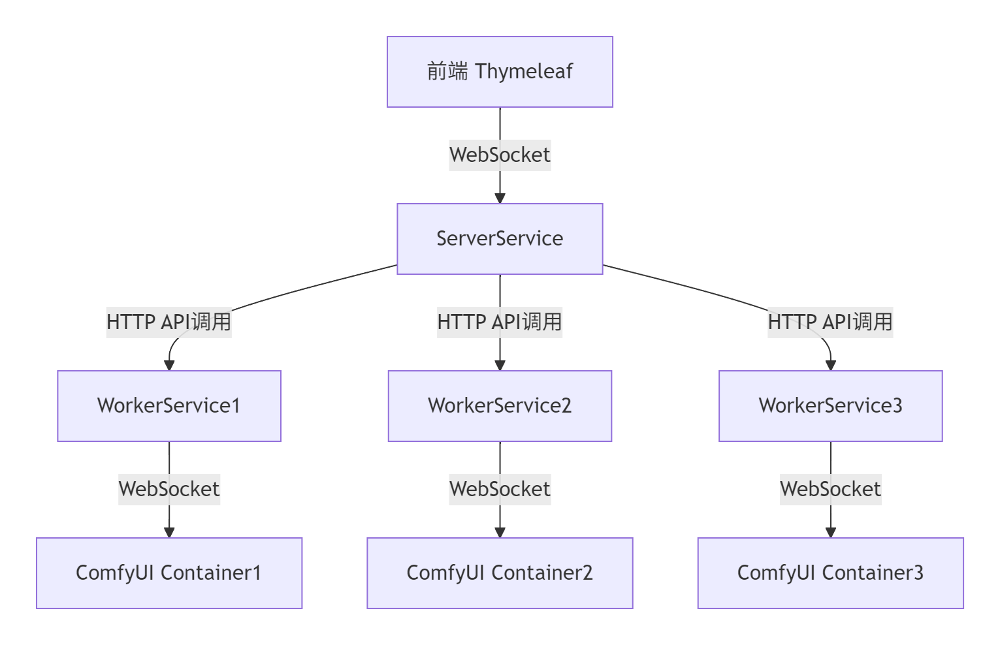
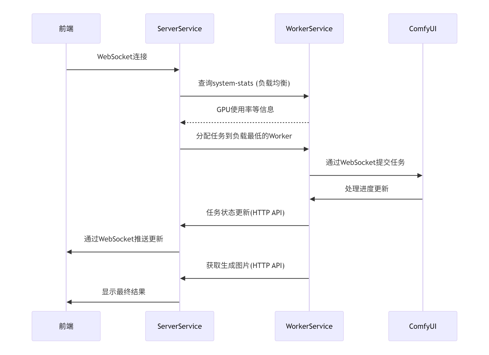
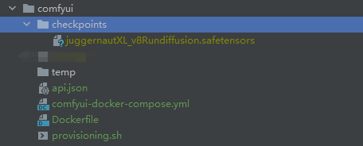

# 系统设计文档
## 项目概述
### 本项目是一个基于ComfyUI的图像处理系统，由四个主要组件构成：

- 前端界面 (Thymeleaf) 
- 服务器服务 (ServerService)
- 工作服务 (WorkerService)
- ComfyUI Docker容器

### demo video
[下载演示视频](./docs/demo.mp4)
<!-- 插入位于 docs 文件夹中的 demo.mp4 -->
<video controls width="600">
  <source src="./docs/demo.mp4" type="video/mp4">
  您的浏览器不支持视频标签
</video>

### 组件图
### 系统架构图


### 任务架构图



### 组件详细说明
1. 前端 (Thymeleaf)
   
   功能：提供用户交互界面
   访问方式：启动项目后，浏览器访问 http://127.0.0.1:8080
   
   通信方式：通过WebSocket与ServerService实时通信
2. ServerService
   
   角色：系统核心协调服务
   主要功能：
   提供WebSocket服务与前端通信
   管理任务分配和状态跟踪
   通过HTTP API与WorkerServices交互
   实现负载均衡策略
   关键API：
   WebSocket端点：实时数据推送
   任务状态更新API：供WorkerService回调
3. WorkerService
   
   角色：ComfyUI容器的工作代理
   主要功能：
   作为WebSocket客户端连接ComfyUI容器
   监控ComfyUI处理进度
   向ServerService报告任务状态
   提供system-stats API供负载均衡使用
   部署：每个ComfyUI容器对应一个WorkerService实例
4. ComfyUI Docker容器
   
   角色：实际执行图像处理的AI服务
   部署方式：每个容器运行一个独立的ComfyUI实例
   通信方式：通过WebSocket与对应的WorkerService通信


### 负载均衡策略.
ServerService通过定期调用WorkerService的system-stats API获取以下信息：
GPU使用率
内存使用情况
基于这些指标，ServerService采用加权轮询算法选择最空闲的WorkerService来分配新任务。

<b>为了减低系统的复杂程度，这一部分并没有实现 <b>
```json
http://127.0.0.1:8188/system_stats
        
{
    "system": {
        "os": "nt",
        "ram_total": 34093641728,
        "ram_free": 17681305600,
        "comfyui_version": "0.3.34",
        "python_version": "3.12.9 (main, Feb 12 2025, 14:52:31) [MSC v.1942 64 bit (AMD64)]",
        "pytorch_version": "2.7.0+cu128",
        "embedded_python": false,
        "argv": [
            "--user-directory",
            "D:\\comfyui\\user",
            "--input-directory",
            "D:\\comfyui\\input",
            "--output-directory",
            "D:\\comfyui\\output",
            "--front-end-root",
            "--base-directory",
            "D:\\comfyui",
            "--extra-model-paths-config",
            "--log-stdout",
            "--listen",
            "127.0.0.1",
            "--port",
            "8000"
        ]
    },
    "devices": [
        {
            "name": "cuda:0 NVIDIA GeForce RTX 3060 Laptop GPU : cudaMallocAsync",
            "type": "cuda",
            "index": 0,
            "vram_total": 12884377600,
            "vram_free": 11801722880,
            "torch_vram_total": 0,
            "torch_vram_free": 0
        }
    ]
}
```

### 部署说明
- 环境
  - jdk17
  - cuda12.1(cuda版本如果大于12.1可能有一些pytorch安装问题)
  - docker
    
- mvn clean install
```shell
$ ./comfy-storydiffusion-assignment mvn clean install
```
- 启动ComfyUI Docker容器
```shell
cd comfyui
docker-compose comfyui-docker-compose.yml up -d
# 启动comfyui 容器非常耗时
```
在 comfyui文件夹下的 api.json是最简单的workflow，

provisioning.sh 是我们安装story diffusion和复制模型的脚本

我们还需要下载模型文件放在我们的checkpoints目的底下
juggernautXL_v8Rundiffusion.safetensors在huggingface上下载
https://huggingface.co/RunDiffusion/Juggernaut-XL-v8/blob/main/juggernautXL_v8Rundiffusion.safetensors

最后comfyui的结构如下



- 为每个容器启动对应的WorkerService

    如果需要部署多个worker服务，需要修改 server.port, websocket.server.url 和 websocket.server.clientId 的内容
要与 comfyui docker 一致，一个workerService 对应一个 comfyui docker
```properties
spring.application.name=worker
server.port=9090
websocket.server.url=ws://127.0.0.1:8188/ws
websocket.server.clientId=test123456789

```
- 启动ServerService
    前端随ServerService自动启动
  
    访问http://127.0.0.1:8080 即可使用系统